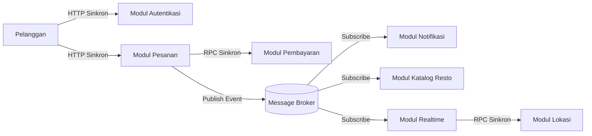

# Tugas 2 (Pekan 2) — Perancangan Arsitektur untuk FoodGo

**Kelompok:** Kelompok 2

| **Nama**                | **NIM**      | **Kontribusi**                                                                                                                                                                                                                                                 |
|-------------------------|--------------|----------------------------------------------------------------------------------------------------------------------------------------------------------------------------------------------------------------------------------------------------------------|
| Rovino Ramadhani        | 103072400031 | Menentukan kombinasi gaya arsitektur SOA dan Publish Subscribe, menyusun diagram arsitektur, menyusun alur skenario end to end, menentukan komunikasi sinkron dan asinkron antar modul, serta melakukan revisi dan penyempurnaan diagram serta struktur tugas. |
| Galang Herjuno Mulya    | 103072430006 | Menyusun dan melengkapi analisis tertulis mengenai penyelesaian masalah serta trade off dari arsitektur yang digunakan.                                                                                                                                        |
| Erastus Liubeta Septian | 103072400020 | Melakukan review terhadap rancangan arsitektur dan alur komunikasi antar modul untuk memastikan skenario FoodGo dapat dipahami secara runtut.                                                                                                                  |
## Gaya Arsitektur

Pilihan utama: Kombinasi Service Oriented Architecture dan Publish Subscribe.

Justifikasi: Service Oriented Architecture untuk validasi transaksi sinkron dan Publish Subscribe untuk mendelegasikan pembaruan data asinkron.

## Alur Skenario Serta Jenis Komunikasi

1. Pengguna melakukan login dan memvalidasi sesi melalui Modul Autentikasi menggunakan komunikasi sinkron berupa HTTP
   request dan response.
2. Pengguna mengirimkan permintaan pembuatan pesanan menuju Modul Pesanan menggunakan protokol HTTP dengan komunikasi
   sinkron.
3. Modul Pesanan mengeksekusi Remote Procedure Call (RPC) ke Modul Pembayaran dengan komunikasi sinkron untuk
   memvalidasi transaksi secara langsung.
4. Modul Pesanan bertindak sebagai publisher untuk mengirimkan event berisi data pesanan sukses ke dalam Message Broker
   menggunakan komunikasi asinkron.
5. Modul Katalog Resto bertindak sebagai subscriber pada Message Broker untuk membaca event secara asinkron, lalu
   memulai instruksi pengurangan stok ke restoran.
6. Modul Notifikasi bertindak sebagai subscriber pada Message Broker untuk membaca event secara asinkron, lalu memicu
   pencarian kurir terdekat.
7. Modul Realtime memanggil Modul Lokasi menggunakan komunikasi sinkron untuk menarik data koordinat, kemudian
   meneruskannya ke antarmuka aplikasi pengguna.
## Analisis Tertulis

### Penyelesaian Masalah

1. Penyelesaian Masalah Coupling: Arsitektur ini membebaskan Modul Pesanan dari proses tunggu. Modul Pesanan memberikan
   respons sukses kepada pengguna setelah pembayaran selesai, tanpa memiliki kewajiban menunggu proses pencarian kurir
   dari Modul Notifikasi berkat penggunaan Message Broker.
2. Isolasi Kegagalan Server: Message Broker bertindak sebagai penampung pesan sementara. Apabila server Modul Katalog
   Resto mengalami crash, data pesanan tidak hilang melainkan tertahan di antrean Message Broker hingga server Modul
   Katalog Resto hidup kembali dan siap memproses data.
3. Penskalaan Independen: Arsitektur terdistribusi memberikan kapasitas penskalaan spesifik untuk setiap komponen.
   Lonjakan permintaan pemantauan rute kurir mewajibkan penambahan server hanya untuk Modul Realtime dan Modul Lokasi,
   tanpa menyita memori atau CPU pada server Modul Pesanan.
4. Bebas Menggunakan Teknologi yang Berbeda: Dengan memisahkan modul menjadi 7 memungkinkan setiap tim pengembang memilih bahasa pemrograman sesuai kebutuhan dari modul yang ingin dikembangkan. Misalnya, Modul Lokasi menggunakan bahasa C++ agar perhitungan koordinat GPS berjalan lebih cepat atau Modul Autentikasi menggunakan Java untuk standar keamanan yang tinggi.

### Penyelesaian Trade Off

1. Kompleksitas Infrastruktur: Arsitektur kombinasi mewajibkan pengelolaan 7 komponen secara terpisah beserta perawatan
   infrastruktur Message Broker. Kondisi ini meningkatkan beban operasional pemantauan server secara drastis
   dibandingkan dengan aplikasi monolitik.
2. Konsistensi Data: Penggunaan gaya Publish-Subscribe menghasilkan sifat eventual consistency. Terdapat jeda waktu
   antara status keberhasilan pada Modul Pesanan dengan pembaruan status ketersediaan pada Modul Katalog Resto.
3. Kesulitan Debugging: Alur eksekusi pesan berjalan secara tidak linear. Masalah kegagalan pesanan mewajibkan teknisi
   untuk membaca log pada banyak server yang berbeda secara bersamaan untuk menemukan titik pasti berhentinya aliran
   data.
<<<<<<< HEAD
4. Risiko Modul Tertahan (Stuck/Hang) pada RPC Sinkron: Ada dua jalur penting yang menggunakan RPC Sinkron, yaitu antara "Modul Pesanan ke Pembayaran" dan "Modul Realtime ke Lokasi". Jika Modul Pembayaran atau Lokasi merespons dengan lambat maka modul pengirimnya bisa ikut tertahan (stuck) menunggu.
=======
4. Risiko Kehilangan Data: Aplikasi menyimpan draf secara otomatis setiap kali pengguna mengubah data, sebelum tombol
   submit ditekan. Draf disimpan di penyimpanan lokal browser dan dimuat kembali saat aplikasi dibuka setelah browser
   mengalami crash, sehingga pengguna tidak perlu mengisi ulang seluruh formulir.
5. Beban Komputasi Berpindah ke Pengguna: Aplikasi memeriksa kemampuan perangkat sebelum memproses data besar. Jika
   perangkat memiliki sumber daya terbatas, pemrosesan dialihkan ke server agar antarmuka tetap responsif dan penggunaan
   CPU serta baterai pada smartphone tidak meningkat secara berlebihan.
6. Fleksibilitas Pengguna: Batas ukuran file ditampilkan sebelum pengguna memilih berkas. Untuk berkas yang melebihi
   batas, aplikasi menawarkan kompresi otomatis atau unggah bertahap, sehingga pengguna tetap dapat mengirim berkas
   tanpa harus menyederhanakannya sendiri terlebih dahulu.
>>>>>>> c5ca80690cc2eab4fc11822bd4636503d0eb486a

