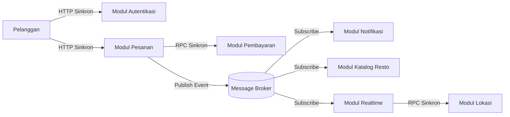

# Tugas 2 (Pekan 2) — Perancangan Arsitektur untuk FoodGo

**Kelompok:** Kelompok 2

| **Nama**                | **NIM**      | **Kontribusi**                                                                                                                                                                                                   |
| ----------------------- | ------------ | ---------------------------------------------------------------------------------------------------------------------------------------------------------------------------------------------------------------- |
| Rovino Ramadhani        | 103072400031 | Single Point of Failure, Ketergantungan pada Vertical Scaling, Tight Coupling dan Terlalu Banyak Proses Synchronous, Desain Database saat Horizontal Scaling, Data yang Sering Diakses Membebani Database Utama  |
| Galang Herjuno Mulya    | 103072430006 | Bandwith is Infinite                                                                                                                                                                                             |
| Erastus Liubeta Septian | 103072400020 | Latency is Zero                                                                                                                                                                                                  |

## Gaya Arsitektur

Pilihan utama: Kombinasi Service Oriented Architecture dan Publish Subscribe.

Justifikasi: Service Oriented Architecture untuk validasi transaksi sinkron dan Publish Subscribe untuk mendelegasikan pembaruan data asinkron.

## Analisis Tertulis

