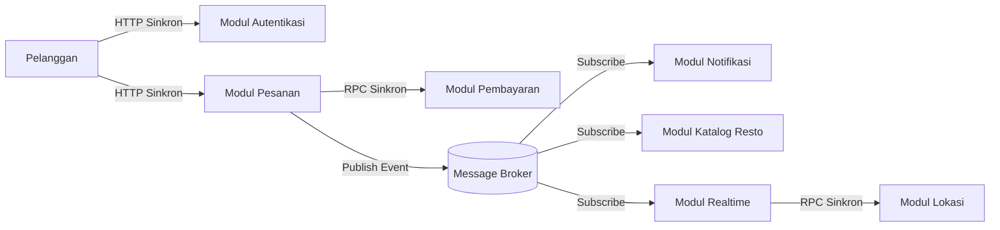

```mermaid
graph LR
  Client[Pelanggan] -->|HTTP Sinkron| AuthSvc[Modul Autentikasi]
  Client -->|HTTP Sinkron| OrderSvc[Modul Pesanan]
  OrderSvc -->|RPC Sinkron| PaymentSvc[Modul Pembayaran]
  OrderSvc -->|Publish Event| Broker[(Message Broker)]
  Broker -->|Subscribe| NotifSvc[Modul Notifikasi]
  Broker -->|Subscribe| RestoSvc[Modul Katalog Resto]
  Broker -->|Subscribe| RealtimeSvc[Modul Realtime]
  RealtimeSvc -->|RPC Sinkron| MapSvc[Modul Lokasi]
```