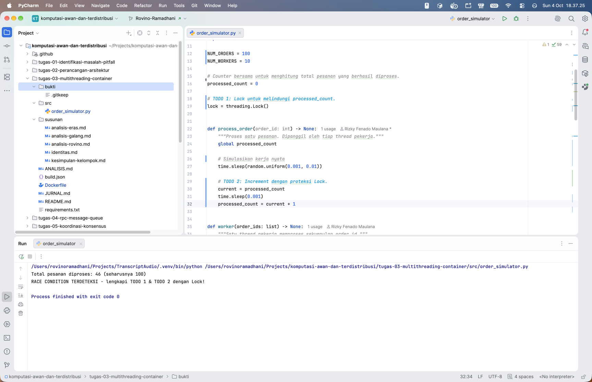
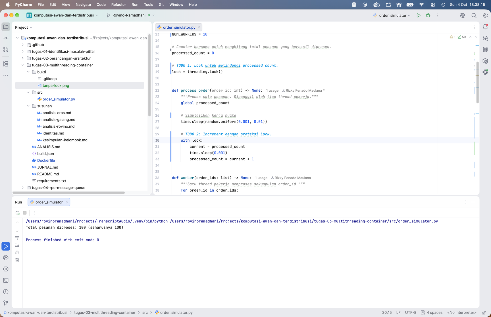
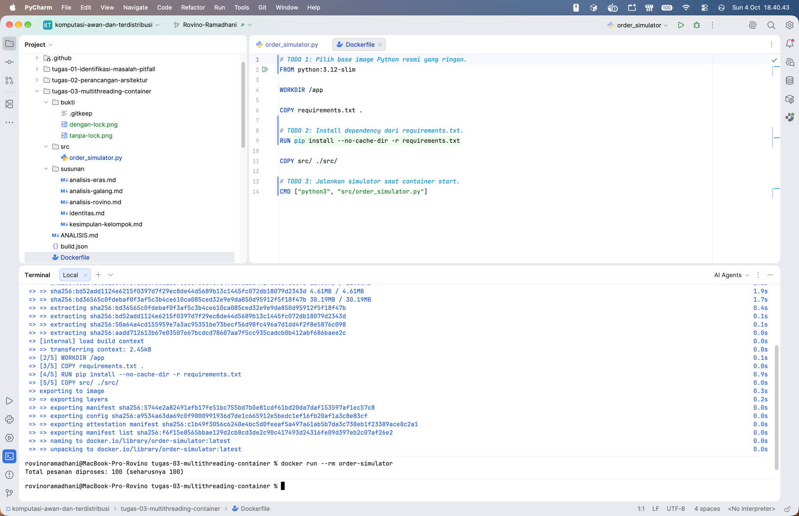

# Jurnal Proses — Tugas 3

## Percobaan tanpa Lock

Pada percobaan pertama, program dijalankan menggunakan multithreading tanpa menggunakan `Lock` pada proses perubahan
nilai `processed_count`.

Hasil yang diperoleh adalah:

`processed_count = 46`

Sedangkan jumlah pesanan yang seharusnya diproses adalah `100`.



Hasil tersebut terjadi karena adanya *race condition*. Beberapa *thread* mengakses nilai `processed_count` pada waktu
yang hampir bersamaan. Pada program, nilai `processed_count` terlebih dahulu dibaca ke dalam variabel `current`,
kemudian diberikan jeda menggunakan `time.sleep(0.001)` sebelum nilainya diperbarui.

Akibatnya, dua atau lebih *thread* dapat membaca nilai yang sama sebelum salah satu *thread* selesai memperbaruinya.
Ketika masing-masing *thread* menulis kembali hasil ke `processed_count`, beberapa proses increment tertimpa sehingga
jumlah akhirnya hanya `46`, bukan `100`.

## Percobaan dengan Lock

Pada percobaan kedua, ditambahkan objek `threading.Lock()` dan proses perubahan `processed_count` dimasukkan ke dalam
bagian berikut:

```python
with lock:
    current = processed_count
    time.sleep(0.001)
    processed_count = current + 1
```

Setelah menggunakan `Lock`, hasil yang diperoleh adalah:

`processed_count = 100`

Nilai tersebut sesuai dengan jumlah pesanan yang seharusnya diproses.



`Lock` memastikan hanya satu *thread* yang dapat menjalankan bagian perubahan `processed_count` pada satu waktu.
*Thread* lain harus menunggu hingga *thread* sebelumnya selesai dan melepas `Lock`. Dengan demikian, perubahan nilai
tidak saling menimpa.

## Kendala Docker

Pada proses `docker build` dan `docker run` tidak ditemukan kendala atau error. Docker image berhasil dibuat menggunakan
`python:3.12-slim`, dan container dapat dijalankan dengan baik.

Hasil eksekusi di dalam container menunjukkan:



Dengan demikian, program berhasil dijalankan di dalam Docker tanpa kendala.

## Log Penggunaan AI (Level 2)

> Wajib diisi sesuai kebijakan Level 2 di [`../RUBRIK-UMUM.md`](../RUBRIK-UMUM.md). Tulis "Tidak memakai AI" pada baris
> pertama jika memang tidak dipakai. Hanya untuk brainstorming ide/outline — bukan untuk kode/analisis/teks akhir.

| Tanggal | Tool AI | Prompt yang diberikan | Ringkasan saran/ide AI | Bagaimana diolah jadi tulisan/kode sendiri |
|---------|---------|-----------------------|------------------------|--------------------------------------------|
| ...     | ...     | ...                   | ...                    | ...                                        |
